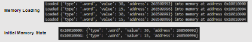

# MIPS-instruction-set-simulator

## Overview
This project implements a MIPS instruction set simulator that reads MIPS assembly code, interprets it, and generates binary machine code. The simulator handles assembly code with `.data` and `.text` sections, translating each `.text` instruction into binary for execution. The tool simulates the operations on a MIPS processor by compiling and executing MIPS assembly language, providing a trace of register and memory states.

## Table of Contents
1. [Understanding of the Task](#understanding-of-the-task)
2. [Architecture Overview](#architecture-overview)
3. [Challenges and Solutions](#challenges-and-solutions)
4. [Detailed Simulator Workflow](#detailed-simulator-workflow)
5. [Example Output](#example-output)
6. [Contributors](#contributors)
7. [Conclusion](#conclusion)
8. [Image](#image)

## Understanding of the Task

The goal is to translate MIPS assembly instructions into binary machine code, simulating a MIPS processor. Key responsibilities include:

1. Parsing `.data` for memory allocation.
2. Parsing `.text` to identify and compile instructions.
3. Managing labels for branching and jumps.

## Architecture Overview
The simulator is structured into two main classes:

**MIPSCompiler**: Parses and compiles assembly into binary. Handles opcode mappings, registers, labels, and instruction types (R-type, I-type, J-type).

**MIPSSimulator**: Executes the compiled binary code, updating registers and memory and simulating instruction execution.

## Challenges and Solutions

**Label Handling**: Managed using a two-pass approach. The first pass collects label addresses, and the second uses these addresses for branch and jump instructions.

**Instruction Parsing**: Created helper functions to handle specific instruction types (R, I, J) to ensure accurate binary translation.

## Detailed Simulator Workflow

The simulator follows these steps:

1. **Parsing**: Reads the assembly code and separates it into `.data` and `.text` sections.
2. **Compilation**: Converts each instruction in the `.text` section into binary.
3. **Execution**: Simulates the execution of the binary instructions, updating registers and memory.

## Example Output

Here is an example of the simulator's output for a simple MIPS program:

```
addi $t0, $zero, 5
addi $t1, $zero, 10
add $t2, $t0, $t1
```

**The binary output will be displayed after execution.**


## Contributors

- Advait Gaur [GitHub](https://github.com/Advaitgaur004/)
- Qazi Talha [GitHub](https://github.com/Qazi-Talha-Ali-087)

## Conclusion

This MIPS instruction set simulator provides a comprehensive tool for understanding and simulating MIPS assembly language, offering insights into the workings of a MIPS processor.

## Image

**During the execution of the above code, the following outputs were generated**

